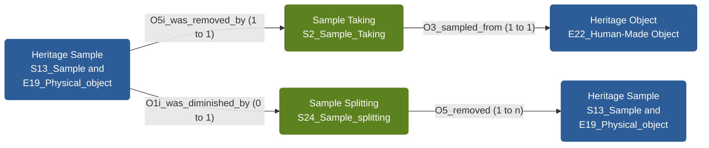

# Heritage Science Modelling at the National Gallery

This repository defines a set of semantic models describing paintings, samples, and associated
heritage-science entities. The goal is to support clear documentation, interoperability, and
FAIR-aligned data sharing across the National Gallery, RICHeS partners, and potential future
collaborations such as the ECHOES project.

All models are defined as **CIDOC CRM-aligned** triple structures using simple TSV files and are
designed for use with the **National Gallery Dynamic Modeller**. These models support ongoing work
to prepare and publish research data through platforms such as **ResearchSpace** and the **HSDS**
(UKRI RICHeS) repository.

Work on these models is supported by **UKRI RICHeS – Heritage Science Data Service (HSDS)** funding,
with contributions from researchers, conservators, and technical specialists across partner
institutions. Additional collaborators will be acknowledged as models continue to evolve.

---

## Visual Overview of All Models

<!-- BEGIN AUTO: NG-MODEL-VISUAL -->

<!-- END AUTO: NG-MODEL-VISUAL -->

---

## Available Models

The following models are defined in this repository.  
Each entry links to its model page, the latest raw TSV file, and the interactive visualisation
in the Dynamic Modeller.

<!-- BEGIN AUTO: MODEL-LIST -->
| Model | Folder | Latest TSV | Visualisation |
|-------|--------|-----------|---------------|
| Samples Model | [`models/samples`](models/samples) | [v1.1](https://raw.githubusercontent.com/RICHeS-UKRI/HSDS-NG-Models/refs/heads/main/models/samples/sample_model_v1.1.tsv) | [Open](https://research.nationalgallery.org.uk/lab/modelling/?url=https://raw.githubusercontent.com/RICHeS-UKRI/HSDS-NG-Models/refs/heads/main/models/samples/sample_model_v1.1.tsv) |
<!-- END AUTO: MODEL-LIST -->

---

## How to Use These Models

1. Open any TSV file directly in the Dynamic Modeller using the “Visualisation” links above.  
2. Review the model-specific page to explore version history and related documentation.  
3. Use these models as a starting point for:
   - ResearchSpace ingestion
   - FAIR data packaging in HSDS
   - ECHOES Digital Twin prototyping
   - Internal NG interoperability work
4. Models are intentionally simple to enable discussion and refinement.  
   CIDOC CRM alignment will be strengthened in future iterations.

---

## Design Principles

- **CIDOC CRM v7.1.3 alignment**
- **Modular, extensible structure**
- **Transparent and easy to review**
- **Supports FAIR Digital Object approaches**
- **Designed for cross-project reusability**

---

## Acknowledgements

This work is supported by **UKRI – RICHeS HSDS** and builds on ongoing collaboration with the
National Gallery’s Heritage Science team and wider partners.  
Additional contributors will be acknowledged as the models evolve.
