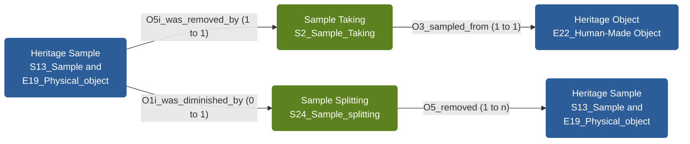

# CIDOC CRM-based models for paintings and samples

This repository collects semantic models (as simple TSV triples) for use with the National Gallery Dynamic Modeller and integration into ResearchSpace.

## Overall NG Models

The current NG-wide model can be explored directly in the Dynamic Modeller:

- [Open in Dynamic Modeller](https://research.nationalgallery.org.uk/lab/modelling/?url=https://raw.githubusercontent.com/RICHeS-UKRI/HSDS-NG-Models/refs/heads/main/models/ng_models_v0.1.tsv)

### Mermaid overview

## Models

The following models are defined under the `models/` folder. Each section lists the available versions and links into the Dynamic Modeller.

Samples Model: <a href="https://research.nationalgallery.org.uk/lab/modelling/?url=https://raw.githubusercontent.com/RICHeS-UKRI/HSDS-NG-Models/refs/heads/main/models/samples/sample_model_v1.1.tsv">1.1</a>

## Samples Model Details

| | Date | Author | Model | Comment |
| :-----------: | :-----------: | :-----------: | :-----------: | ----------- |
| :heavy_check_mark: |  |  | [1.1](https://research.nationalgallery.org.uk/lab/modelling/?url=https://raw.githubusercontent.com/RICHeS-UKRI/HSDS-NG-Models/refs/heads/main/models/samples/sample_model_v1.1.tsv) |  |
| |  | |  |  |

